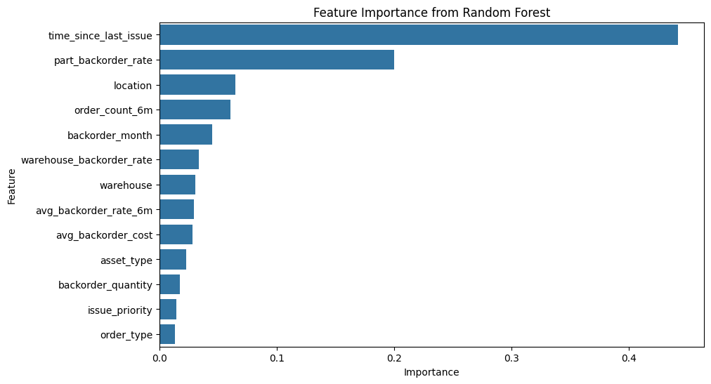
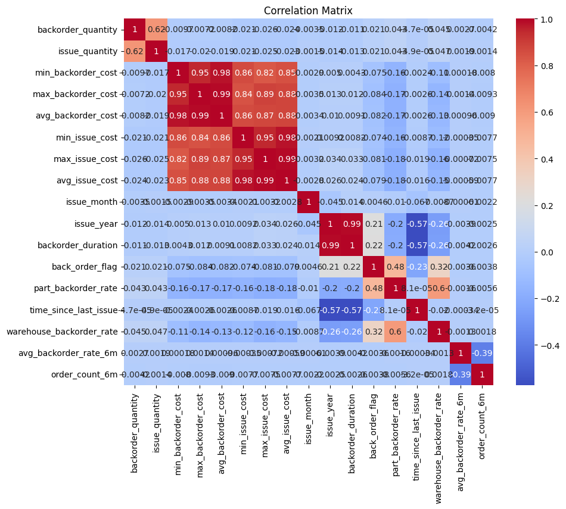

# Back Order Management Analytics & Prediction - Capstone Project

## Project Overview
This project analyzes historical back-order data to identify drivers of delayed fulfillment and support data-driven inventory planning. The goal is to transform operational data into actionable insights that reduce back orders, improve supplier responsiveness, and enable proactive procurement decisions.

The work combines:
- Exploratory data analysis (EDA)
- Feature engineering
- Classification and regression modeling
- Business-focused interpretation of model outputs

---

## Problem Statement
Back orders occur when demand cannot be fulfilled due to inventory shortages or supply chain delays. Limited early visibility creates:
- Customer dissatisfaction
- Higher operational and expedite costs
- Inefficient procurement planning

This project addresses:
- Which factors most influence back orders?
- How can historical data predict future delays?
- Which signals support proactive inventory decisions?

---

## Key Results

### Model Performance
- **Best Classification Model**: Random Forest Classifier
- **Random Forest Accuracy**: **0.97** on test set
- **Backorder Class (Class 0)**: Precision **0.90**, Recall **0.66**, F1 **0.76**
- **Baseline (Logistic Regression) Accuracy**: **0.95**
- **Random Forest Regressor**: MAE **21.11**, MSE **9458.67**, R² **0.972**

### Top Predictive Features (Random Forest)
1. **time_since_last_issue** (~0.44 importance)
2. **part_backorder_rate** (~0.20 importance)
3. **location** (~0.06 importance)

### Key Insights
- Historical delay behavior and recency features are strong leading indicators of backorder risk.
- Location-level behavior and part-level backorder trends materially improve prediction quality.
- Combining classification (risk flagging) with regression (timing estimation) supports proactive planning.

---

> Note: The `Data/` directory is intentionally excluded from version control to protect sensitive and proprietary information.

---

## Data Description (High Level)
The dataset includes historical back-order records with variables related to:
- Inventory levels
- Supplier lead times
- Demand indicators
- Fulfillment delays
- Back-order status (target)

No raw source data is published in this repository for privacy and compliance reasons.

---

## Analysis & Methodology
The notebook (`capstone.ipynb`) follows this workflow:

1. **Data Understanding**
   - Schema and field inspection
   - Missing value checks
   - Distribution profiling

2. **Data Cleaning & Preparation**
   - Handling missing/inconsistent records
   - Type normalization and transformations
   - Business rule checks

3. **Exploratory Data Analysis**
   - Correlation analysis
   - Backorder and issue behavior analysis
   - Segment-wise trend checks

4. **Modeling**
   - Classification (Logistic Regression, Random Forest)
   - Regression (Random Forest Regressor)
   - Evaluation using precision, recall, F1, accuracy, MAE, MSE, and R²

5. **Business Interpretation**
   - Identify operational risk indicators
   - Translate outputs into procurement actions

---

## Sample Visualizations

### Feature Importance (Random Forest)

*`time_since_last_issue` and `part_backorder_rate` are dominant predictors in the trained classifier.*

### Correlation Matrix

*Feature relationship map used to validate dependencies and support feature selection decisions.*

---

## Tools & Technologies
- Python
- Pandas / NumPy
- Matplotlib / Seaborn
- Scikit-learn
- Jupyter Notebook
- Excel (source files)
- Git & GitHub

---

## Requirements
Install dependencies:

```bash
pip install -r requirements.txt
```

---

## How to Run This Project

1. Clone the repository:

```bash
git clone https://github.com/your-username/Capstone.git
cd Capstone
```

2. Install dependencies:

```bash
pip install -r requirements.txt
```

3. Open and run the notebook:

```bash
jupyter notebook capstone.ipynb
```

4. Keep your own source dataset in a local `Data/` folder (not tracked by git).
